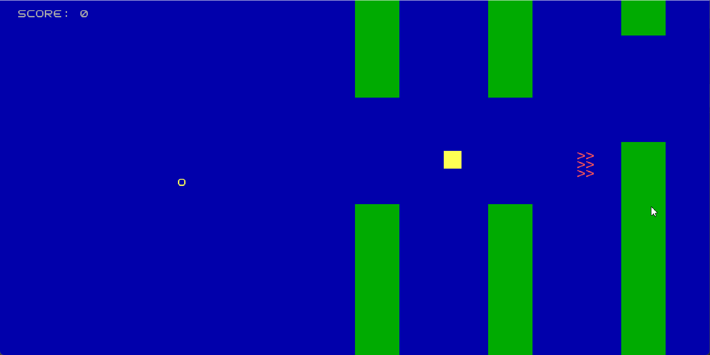
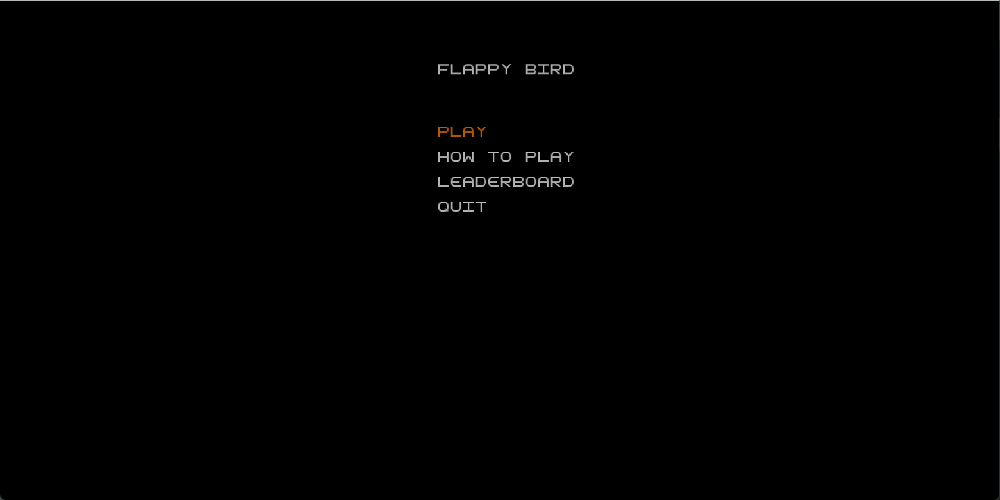
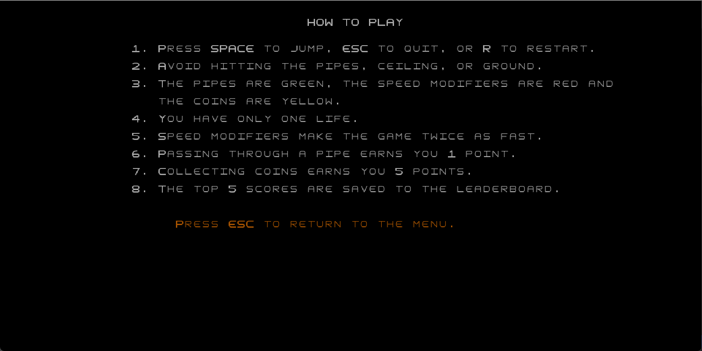
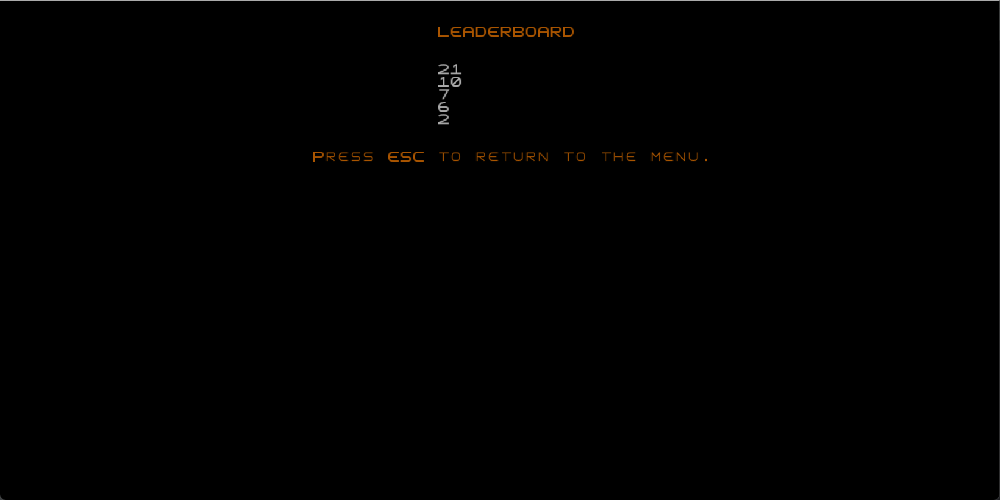
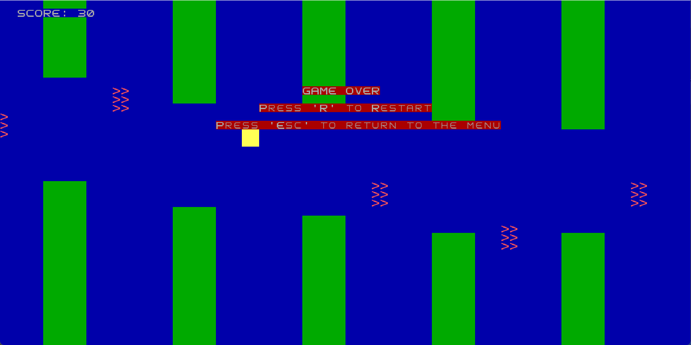

# LDTS_T03_G06 - FLAPPY BIRD
The game is inspired by the popular "Flappy Bird." Players control Flappy, a bird, with the goal of navigating through as many pipes as possible while collecting points. Points are earned in two ways: passing through pipes awards 1 point, and collecting coins grants 5 points. In addition to pipes and coins, there are modifiers that, when collected, increase the game’s speed for 5 seconds.

The game has no predefined end and only concludes when the player collides with an obstacle.

This project was developed by Guilherme Cardozo de Castro Melo (up202401169@edu.fe.up.pt), Tiago Zou Yin (up202306438@edu.fe.up.pt), and Fernando Oliveira (up201005231@edu.fe.up.pt) for LTDS 2024–2025.

For a more detailed version of this description click [here](./docs/README.md).

## Screenshots

The following screenshots ilustrate the general look of our game, as well as the divergent functionalities:

### Game preview

  

  <b><i>Gif 1. Sneak peak into FLAPPY BIRD game</i></b>

 
 

### Menus

  

  <b><i>Fig 1. Main Menu </i></b>

  

 
 

  

  <b><i>Fig 2. Instructions Menu </i></b>  

  

 
 

  

  <b><i>Fig 3. Leaderboard Menu </i></b>

  

 
 

### End Game

  

  <b><i>Fig 4. Game Over</i></b>

 
 

